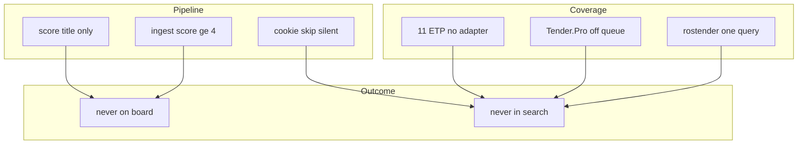
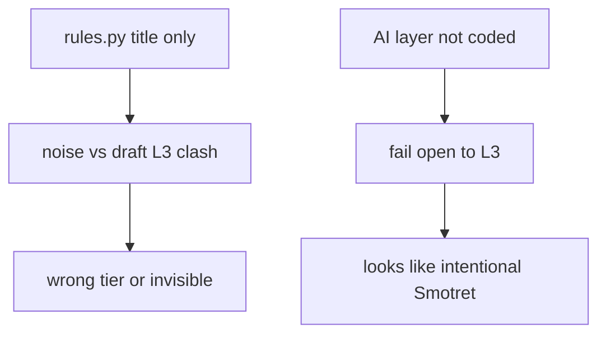

# Ревью решений: узкие места (пропуски + ИИ)

**status:** draft  
**last-review-date:** 2026-08-27  
**owner lock (после review):** [`owner-decisions.md`](./owner-decisions.md)
**тип:** cross-skill review (без кода)  
**маршрут:** scout-product-manager → scout-architect → scout-backend/scout-qa (lens) → scout-documentation-writer  
**контекст:** owner lock 2026-08-26 по [`inbox-lifecycle.md`](./inbox-lifecycle.md), [`fit-tiers.md`](../delivery/fit-tiers.md), [`ai-tier-review.md`](../delivery/ai-tier-review.md); код 027–029 ещё не в репо

---

## Вердикт

**Да, узкие места есть — и они реальные.** Два главных страха владельца обоснованы:

1. **Мы находим не все тендеры** — покрытие сейчас узкое (одна площадка в очереди, один seed-запрос, cap 1000, фильтр «только открытые», score только по title), а часть «найденного» вообще не попадает на доску.
2. **ИИ и правила могут «тупить»** — AS-IS scoring уже противоречит draft fit-tiers; ИИ (029) не в коде; при сбое всё уходит в L3 «Смотреть» без явного сигнала «тиры не доверять».

**Топ-5 узких мест (P0):**

| # | Что ломается | Почему это больно |
| --- | --- | --- |
| 1 | Inbox = `score ≥ 4` → авто-L3 (2–3) **никогда** не на доске | Tech MD показывает «нашли L3», Sales Inbox — нет. **Канон P12:** пул L1–L3; **код** до 029 ещё score≥4 |
| 2 | Живой скрейп ≈ rostender + «неразрушающий»; Tender.Pro off; 11 ЭТП без адаптеров | Тихий пропуск целых площадок и формулировок |
| 3 | AS-IS last-wins ingest vs целевой 028 update-on-diff | Backend: код ещё last-wins; **канон P12** = update-on-diff |
| 4 | AS-IS: поставка приборов → `noise`; дыра «Поставка **оборудования**…» → L1 | Железо в Горячих или вне доски — оба плохо |
| 5 | Wipe после 027–029 сносит `viewed` / `manual_tier` | Единственная «память» директора исчезает |

**Рекомендация:** owner lock 2026-08-27 закрыт; **P12** ([032](../delivery/tasks/032-api-canon-sync.md)) синхронизировал accepted API. Дальше код 027 → 028 → 029.

---

## Маршрут ревью

| Скилл | Что проверял | Фокус |
| --- | --- | --- |
| **scout-product-manager** | JTBD директора, acceptance, open-questions | «Не пропустить услугу» + «не кормить Горячие железом» — оба ломаются **молча** |
| **scout-architect** | Контракты ingest/inbox/lifecycle, фазы, API | 028/029 требуют rewrite accepted до кода, иначе backend гадает |
| **scout-backend / scout-qa (lens)** | `runner.py`, `ingest.py`, `rules.py`, `tiers.py`, seed | Конкретные ветки skip/error/stop; нет goldenset и coverage smoke |
| **scout-documentation-writer** | Сбор findings, CANON, evidence map | Этот документ |

---

## P0 — must lock до / вместе с кодом 027–029

### M1. Inbox отсекает авто-L3 (score 2–3)

| | |
| --- | --- |
| **Что** | **AS-IS код:** ingest и `/api/inbox` держат только `score ≥ 4`. Тир L3 по [`tiers.py`](../../app/scoring/tiers.py) = score **2–3**. **Канон P12:** колонка «Смотреть» (L3) на доске; ingest/inbox по `tier ∈ {L1,L2,L3}`. |
| **Evidence** | `INBOX_MIN_SCORE = 4` в [`app/worker/ingest.py`](../../app/worker/ingest.py); фильтр в [`app/api/inbox.py`](../../app/api/inbox.py). Пример: `runs/2026-08-13/tenders.md` — много строк score=3 tier=L3, на доску не попадут. Канон: [`sales-inbox-api.md`](../delivery/sales-inbox-api.md). |
| **Как заметит оператор** | Почти не заметит: Tech `priority-fit.md` / `tenders.md` показывают L3; Sales Inbox — нет. «Мало лотов» вместо «фильтр съел Смотреть». |
| **Mitigation (high-level)** | **Docs closed (P12):** пул L1+L2+L3. Код — [029](../delivery/tasks/029-tier-rules-and-ai.md). |

---

### M2. Узкое покрытие скрейпа

| | |
| --- | --- |
| **Что** | Seed: «РосТендер НК» `in_queue=True`, query `["неразрушающий"]`; «Tender.Pro НК» `in_queue=False`. ~11 ЭТП в реестре без адаптера → `"No adapter — skip"`. |
| **Evidence** | [`alembic/versions/0003_searches.py`](../../alembic/versions/0003_searches.py); [`platforms.md`](./platforms.md) (tender-pro всё ещё `backlog`, хотя 024 **done**); [`named-searches.md`](./named-searches.md). |
| **Как заметит оператор** | Иконки площадок в UI есть, лотов с них — нет. Tender.Pro: только если включить в очередь вручную. Пропуск по синонимам (ВИК/УЗК без «неразрушающий») — **полная тишина**. |
| **Mitigation** | Расширить `queries[]` rostender (синонимы методов); включить Tender.Pro при валидных cookies; post-run отчёт: per-search status + truncated-at-limit (028). Адаптеры остальных ЭТП — отдельный backlog. |

---

### M3. Canon clash: last-wins vs freeze living

| | |
| --- | --- |
| **Что** | **Канон P12 / 028:** update-on-diff — без изменений на площадке карточку не трогаем; с diff — обновляем; triage не сбрасываем. **Код P9/028 done.** |
| **Evidence** | [`app/worker/ingest.py`](../../app/worker/ingest.py) — classify insert/update/skip; Task [028](../delivery/tasks/028-run-idempotent-report.md); API [`sales-inbox-api.md`](../delivery/sales-inbox-api.md) § Ingest. |
| **Как заметит оператор** | Лот «исчез» с доски после re-run (score упал ниже 4) **или** поля устарели / перезаписались — пока код не на update-on-diff. |
| **Mitigation** | **Docs closed (P12).** Код **done** — [028](../delivery/tasks/028-run-idempotent-report.md). |

---

### M4. AS-IS scoring vs draft fit-tiers

| | |
| --- | --- |
| **Что** | **AS-IS:** [`rules.py`](../../app/scoring/rules.py) — `RE_BUY_DEVICE` / `is_noise` → поставка приборов = **noise** (вне доски). **Draft fit-tiers:** поставка / калибровка / приборы → **L3 «Смотреть»**. Дыра regex: «Поставка **оборудования** для НК» может не попасть под `RE_BUY_DEVICE` (нет «прибор/дефектоскоп» в окне) → высокий score → **L1**. |
| **Evidence** | [`rules.py`](../../app/scoring/rules.py) L29–34, L97–106; [`fit-tiers.md`](../delivery/fit-tiers.md) § «всегда Смотреть»; run `runs/2026-08-13` — «Поставка … оборудования …» с tier L1. |
| **Как заметит оператор** | Железо в Горячих (плохо) или вне доски как noise (тоже плохо после lock). Без единого канона — хаос. |
| **Mitigation** | 029: жёсткие правила «всегда L3» **до** ИИ; расширить `RE_BUY_DEVICE` на «оборудование для НК»; goldenset эталонов в unit-тестах. |

---

### M5. Wipe после 027–029 уничтожает triage-память

| | |
| --- | --- |
| **Что** | Lifecycle Ops: полная очистка лотов + связанного inbox state, затем полный прогон. JTBD [`sales-inbox.md`](./sales-inbox.md): `viewed` / `manual_tier` **не сбрасываются** новым прогоном — wipe противоречит. |
| **Evidence** | [`inbox-lifecycle.md`](./inbox-lifecycle.md) § Ops; task [029](../delivery/tasks/029-tier-rules-and-ai.md) «после деплоя всех трёх — wipe». |
| **Как заметит оператор** | После wipe все «просмотрено» и ручные приоритеты — с нуля. |
| **Mitigation** | **Closed 2026-08-27:** wipe = всё (lots + lot_state + documents + том docs); без экспорта. См. owner-decisions №9. |

---

## P1 — высокий риск доверия / покрытия

### S1. Score только по title; нет re-score после карточки

- **Что:** [`pipeline.py`](../../app/scoring/pipeline.py) — `assign_tier(title)` только. Карточки (P3) для L1–L3; после enrich **нет** повторного score.
- **Риск:** Tender.Pro: title «Мебель», ВИК в goods — остаётся pool/noise. Rostender: слабый title, сильное описание — не спасается.
- **Evidence:** [`tender_pro.py`](../../app/worker/tender_pro.py) enrich; probe [`tender-pro-probe.md`](./tender-pro-probe.md).
- **Mitigation:** Re-score после card/goods; или fetch cards для borderline pool; ИИ (029) частично закрывает, но только score≥4 **новые**.

### S2. Cap 1000 + multi-query starvation

- **Что:** `limit_n ≤ 1000`; rostender newest-first; `scrape_queries` заполняет лимит с **первого** query — остальные голодают.
- **Evidence:** [`list_scrape.py`](../../app/worker/list_scrape.py); [`named-searches.md`](./named-searches.md) Q1.
- **Mitigation:** Per-query budget; отчёт «platform total vs scraped»; поднять cap или split searches.

### S3. Early pagination break на пустой filtered page

- **Что:** Если после фильтра open/upcoming страница дала 0 строк — цикл **прерывается**, хотя дальше могут быть открытые лоты.
- **Evidence:** [`list_scrape.py`](../../app/worker/list_scrape.py) ~266–280.
- **Mitigation:** Различать «нет HTML» vs «все отфильтрованы»; N пустых filtered pages перед stop.

### S4. Cookies: file exists ≠ session OK

- **Что:** Missing rostender cookies → step **`skipped`**, queue continues. `refresh_session()` проверяет **наличие файла**, не живую сессию. Overall run часто **`done`** после step errors.
- **Evidence:** [`runner.py`](../../app/api/runner.py) L253–264; [`auth-cookies.md`](../delivery/auth-cookies.md).
- **Mitigation:** Probe HTTP перед queue; fail-closed option; overall `partial` при skip/error.

### S5. Нет HTTP retry 429/5xx

- **Что:** `raise_for_status()`; delays 0.15–0.25s; transient blip → пустой/partial list.
- **Mitigation:** Bounded retries; счётчик в Tech.

### S6. Soft stop до P3 → пустой ingest

- **Что:** Stop after P1/P2 → ingest `stopped` с **пустыми** rows; scored pool выбрасывается.
- **Evidence:** [`runner.py`](../../app/api/runner.py) L288–291, L308–310.
- **Mitigation:** Ingest score≥4 из scored list даже при stop после P2.

### S7. ИИ (план 029): fail-open в L3

- **Что:** Нет ключа / обе модели упали → **L3** + `ai_tier_failed`; прогон жив. Выглядит как осознанное «Смотреть».
- **Evidence:** [`ai-tier-review.md`](../delivery/ai-tier-review.md) L74–75, L26–27.
- **Риски ИИ «тупит»:**
  - JSON с markdown fences / лишний текст → parse fail → L3.
  - Модель поднимает поставку в L1 вопреки промпту.
  - Запрет «класс опасности» легко нарушить моделью.
  - Вход только title + кусок описания — **не PDF**, не полное ТЗ.
  - Массовый L3 при outage provod.ai = «все в Смотреть» без красного флага в UI.
- **Mitigation:** Счётчик `ai_tier_failed` в отчёте 028 **рядом** с «Новые/Уже были»; красный баннер при массовом fail; strict JSON schema + retry parse; goldenset + mock HTTP в CI.

### S8. Daily expiry без shipped cron

- **Что:** 027 требует «тихий суточный шаг»; platform-phases: cron = NEXT+. Между прогонами просроченные могут висеть в L1–L3 до шага.
- **Mitigation:** Read-time filter по `deadline_msk` в API **или** minimal cron в 027.

### S9. Один тендер на двух ЭТП = две карточки

- **Что:** `tender_id = {platform}:{native}` — нет cross-ETP dedup.
- **Mitigation:** Продуктово OK как две карточки; документировать; future merge key — out of scope.

### S10. Stale live card (freeze) vs platform reality

- **Что:** 028 freeze → extended deadline / NMЦ на площадке не попадает в карточку.
- **Mitigation:** Accept stale **или** narrow refresh (deadline/status only) без сброса triage.

---

## P2 — следить / документировать

| ID | Риск | Evidence |
| --- | --- | --- |
| W1 | Слабые синонимы методов в search/scoring (МПД, АЭ, TOFD/PAUT, эндоскопия) | [`relevance-rules.md`](./relevance-rules.md); [`card_scrape.py`](../../app/worker/card_scrape.py) `METHOD_PATTERNS` |
| W2 | `open-questions.md` «всё closed», lock 2026-08-26 не отражён | [`open-questions.md`](./open-questions.md) vs lifecycle/fit-tiers |
| W3 | Dual SoT: Postgres inbox vs `runs/*/tenders.md` | [`output-schema.md`](./output-schema.md) |
| W4 | `platforms.md` tender-pro = backlog при 024 done | [`platforms.md`](./platforms.md) |
| W5 | Лоты без deadline — вне доски после wipe | [`inbox-lifecycle.md`](./inbox-lifecycle.md) L46 |
| W6 | «Ушли в просроченные» ≠ «нашли в scrape» — смешение смыслов | lifecycle § отчёт 028 |
| W7 | Архив `board_hidden` — discoverability без явного UI | lifecycle § архив |

---

## Канон-клаши (таблица)

| Тема | Документ A (accepted) | Документ B (draft / код) | AS-IS код | Нужен owner lock |
| --- | --- | --- | --- | --- |
| Пул inbox | sales-inbox-api P12: L1–L3 | fit-tiers + lifecycle: L3 на доске | ingest/inbox score≥4 | **Lock closed**; код 029 |
| Re-ingest | sales-inbox-api P12: update-on-diff | lifecycle + 028 | ON CONFLICT UPDATE all | **Lock closed**; код 028 |
| Поставка приборов | relevance-rules: exclude → noise | fit-tiers: L3 «Смотреть» | is_noise → вне доски | **Да** (029) |
| ИИ на каждый новый | — | ai-tier-review + 029 | не реализовано | accept draft перед кодом |
| Tender.Pro live | platforms: backlog | 024 done, adapter in code | seed off-queue | enable + fix platforms.md |
| viewed / manual_tier | sales-inbox: survive re-run | lifecycle wipe | survive re-run AS-IS | wipe scope |
| Cron expiry | platform-phases: NEXT+ | 027: daily step | нет | механизм в 027 |

---

## Перекрёстная проверка скиллов (итог)

### PM

- **JTBD:** директор хочет не пропустить **услугу** и не тратить время на **железо в Горячих**.
- **Факт:** оба сценария ломаются **без явного сигнала** — услуги score 2–3 не на доске; «Поставка оборудования» может быть L1; площадки без адаптера = нулевое покрытие.
- **Hypothesis:** после 029+расширения queries покрытие улучшится, но без lock M1/M3/M4 backend снова разойдётся с продуктом.

### Architect

- Контракты **028** и **029** требуют **rewrite accepted** `sales-inbox-api.md`, `sales-inbox.md` Q10–12, возможно `platform-phases.md` **до** merge кода.
- Иначе: backend реализует freeze, API-doc говорит last-wins; или ingest L3, product говорит auto-L3 out.
- Риск rollback: wipe без export triage — необратимая потеря.

### Backend / QA lens

- Must-fix до ship **029:** unit goldenset (эталоны fit-tiers); mock HTTP provod.ai; `ai_tier_failed` в отчёте **028**; тест «RE_BUY_DEVICE ловит оборудование».
- Coverage gap: нет smoke «query hit rate» / «platforms attempted vs skipped».
- Phase boundary: 027→028→029 строго по одному; не смешивать в один PR.

---

## Цепочки провала (диаграммы)

### Пропуск тендеров

### ИИ / тиры

---

**Следующий шаг (не в scope этого файла):** ответы владельца → [`owner-decisions.md`](./owner-decisions.md) (2026-08-27) → синхронизация accepted canon → код 027 → 028 → 029.

---

## Закрыто владельцем (2026-08-27)

| Было (риск / вопрос) | Решение | Документ |
| --- | --- | --- |
| M1 — auto-L3 не на доске | **Смотреть** = системный L3 на доске (L1+L2+L3) | [`owner-decisions.md`](./owner-decisions.md) №1 |
| M3 — freeze vs last-wins | **Обновляем** карточку при diff на площадке; triage не сбрасываем | owner-decisions №2 |
| Лимит 1000 / starvation | **Лимит убран**; пакеты A–E | [`search-keywords.md`](./search-keywords.md) |
| ИИ при каждом ingest | **Отдельный шаг**; раздел «Разобрано с помощью ИИ» | owner-decisions №5 |
| M5 — wipe triage | Wipe = **всё** (lots + lot_state + documents + том docs); без экспорта | owner-decisions №9 · lifecycle |
| Keyword miss / морфология | Усечения + страховка E; ИИ чистит мусор | owner-decisions №7–8 |
| Уровень D «только правила» | Четыре контроля **в поиске** (пакет D) | owner-decisions №6 |

Старый блок «Вопросы владельцу» ниже — **архив review**. Актуальные ответы — только в [`owner-decisions.md`](./owner-decisions.md).

---

## Вопросы владельцу (архив review — superseded)

1. **Доска после 029:** L1+L2+L3 (score≥4 после AI) **или** по-прежнему auto-L3 (2–3) out of inbox?
2. **028:** freeze living **или** last-wins — какой SoT **accepted**? Исключения (только deadline)?
3. **Wipe:** только `lots` или + `lot_state` / `documents` / docs volume? Экспорт `viewed`/`manual_tier` до wipe?
4. **Rostender queries:** расширять синонимы **сейчас** (до адаптеров) или ждать?
5. **ИИ fail-mass → L3:** OK как «осторожно», или **красный баннер** «ИИ недоступен, тиры не доверять»?
6. **Cross-ETP dup:** две карточки на один коммерческий тендер — OK?
7. **Stale deadline:** accept freeze **или** narrow refresh on «уже был»?

---

## Evidence map

| Тема | Путь |
| --- | --- |
| Inbox min score | [`app/worker/ingest.py`](../../app/worker/ingest.py), [`app/api/inbox.py`](../../app/api/inbox.py) |
| Scoring rules / tiers | [`app/scoring/rules.py`](../../app/scoring/rules.py), [`app/scoring/tiers.py`](../../app/scoring/tiers.py), [`app/scoring/pipeline.py`](../../app/scoring/pipeline.py) |
| Runner / skip / stop | [`app/api/runner.py`](../../app/api/runner.py) |
| List scrape / pagination | [`app/worker/list_scrape.py`](../../app/worker/list_scrape.py) |
| Tender.Pro adapter | [`app/worker/tender_pro.py`](../../app/worker/tender_pro.py) |
| Seed searches | [`alembic/versions/0003_searches.py`](../../alembic/versions/0003_searches.py) |
| Platform IDs | [`app/worker/platform_ids.py`](../../app/worker/platform_ids.py) |
| Lifecycle (draft) | [`inbox-lifecycle.md`](./inbox-lifecycle.md) |
| Fit tiers (draft) | [`../delivery/fit-tiers.md`](../delivery/fit-tiers.md) |
| AI review (draft) | [`../delivery/ai-tier-review.md`](../delivery/ai-tier-review.md) |
| Tasks 027–029 | [`../delivery/tasks/027-expired-column.md`](../delivery/tasks/027-expired-column.md), [`028`](../delivery/tasks/028-run-idempotent-report.md), [`029`](../delivery/tasks/029-tier-rules-and-ai.md) |
| Accepted API | [`../delivery/sales-inbox-api.md`](../delivery/sales-inbox-api.md) |
| Accepted product | [`sales-inbox.md`](./sales-inbox.md) |
| Platforms registry | [`platforms.md`](./platforms.md) |
| Named searches | [`named-searches.md`](./named-searches.md) |
| Relevance / search v0 | [`relevance-rules.md`](./relevance-rules.md) |
| Example runs | [`../../runs/2026-08-13/tenders.md`](../../runs/2026-08-13/tenders.md) |

---

## Связанные документы

- [`inbox-lifecycle.md`](./inbox-lifecycle.md) — целевое поведение после 027–028
- [`fit-tiers.md`](../delivery/fit-tiers.md) — целевые правила тиров
- [`ai-tier-review.md`](../delivery/ai-tier-review.md) — целевой слой ИИ
- [`owner-decisions.md`](./owner-decisions.md) — решения владельца простым языком
- [`search-keywords.md`](./search-keywords.md) — ключевые слова и очередь
