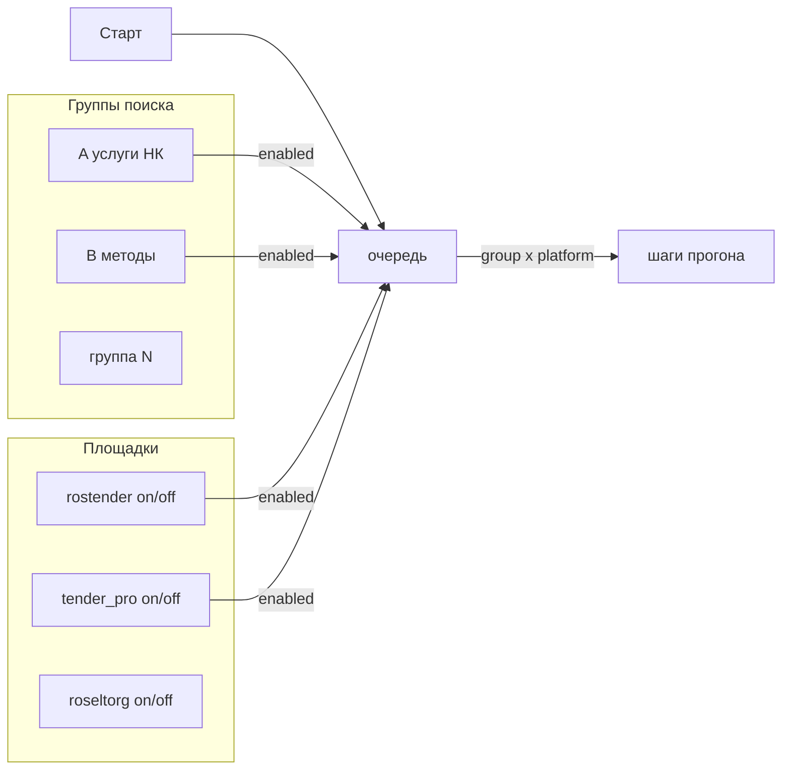

# Группы поиска × площадки (Директ-модель)

**status:** accepted (owner lock 2026-08-29; runtime 048 **done**; UI 049)  
**last-review-date:** 2026-08-29  
**owner lock:** 2026-08-29 (эпик end-state; группа на все включённые ЭТП; docs-first)  
**supersedes UI/entity model of:** [`named-searches.md`](./named-searches.md) (shim `/api/searches*` до 049)  
**плюс/минус pipeline:** [`search-system-v2.md`](./search-system-v2.md)  
**лексикон A–E:** [`search-keywords.md`](./search-keywords.md)  
**реестр ЭТП:** [`platforms.md`](./platforms.md)  
**API:** [`../delivery/search-groups-api.md`](../delivery/search-groups-api.md) (`accepted`)  
**IA Прогон:** [`design/sales-inbox-wireframes.md`](./design/sales-inbox-wireframes.md) (W-run)  
**задачи:** [044](../delivery/tasks/044-search-groups-discovery.md)…[047](../delivery/tasks/047-run-ux-copy.md) docs **done** · [048](../delivery/tasks/048-search-groups-backend.md) **done** · [049](../delivery/tasks/049-search-groups-ui.md)–[050](../delivery/tasks/050-search-groups-qa.md) UI/QA

---

## Owner lock (2026-08-29)

| # | Решение |
| --- | --- |
| 1 | End-state одним эпиком: **модель групп + перестройка вкладки «Прогон»** (не «сначала косметика») |
| 2 | Группа **всегда** действует на все **включённые** площадки; у группы **нет** выбора ЭТП |
| 3 | Сейчас — только discovery / delivery / дизайн / копирайт / карточки. **Код = 048+** после `accepted` на 044–047 |

---

## Problem

AS-IS ([023](../delivery/tasks/023-named-searches.md) + [041](../delivery/tasks/041-shared-search-packages.md)): одна строка `searches` = **одна** площадка. Одинаковые плюс/минус A–E **дублируются** (15 строк на 3 ЭТП). Оператор включает/выключает каждую строку отдельно — как в MVP, не как в Яндекс.Директ.

Нужно:

1. **Группа поиска** — плюс + минус один раз.  
2. **Площадки** — отдельно вкл/выкл.  
3. **Группы** — отдельно вкл/выкл (очередь).  
4. Вкладка «Прогон» — логические блоки, без сырых MVP-артефактов в основном потоке.

---

## Users

| Кто | Job |
| --- | --- |
| Digital / директор | Править группы (плюс/минус), включать площадки и группы, Старт |
| Продажи | Inbox без изменений модели лотов |

---

## Целевая модель



### Сущность «группа» (`search_group`)

| Поле | Правило |
| --- | --- |
| `id` | UUID |
| `name` | человеческое; уникально в инстансе (без префикса площадки) |
| `queries` | плюс-фразы; минимум 1; порядок **слож → прост** |
| `exclude` | минус-фразы; может быть `[]`; режет title **на списке** до скоринга ([`search-system-v2.md`](./search-system-v2.md)) |
| `limit_n` | soft stop; **`0` = без потолка** |
| `in_queue` | группа участвует в следующем Старте |
| `sort_order` | порядок групп в развороте очереди |

**Группа не привязана к площадке.** Площадки включаются отдельно. Площадочные фильтры (открыт, РФ, поле поиска) — в адаптере, не в UI группы.

Кастомные группы — CRUD. В карточке/drawer группы **нет** select площадки.

### Сущность «площадка» (first-class enable)

| Поле | Правило |
| --- | --- |
| `platform_id` | slug из [`platforms.md`](./platforms.md): `rostender` \| `tender-pro` \| `roseltorg` (позже — новые) |
| `enabled` | участвует в Старте (декартово с группами) |
| session | статус cookies для UI (ОК / нет сессии / устарела / список без входа) — **без** имён файлов в primary-строке |

Нет «поиска на ЭТП» как отдельной сущности оператора.

### Очередь Старта

```text
{группы с in_queue} × {площадки с enabled}
  порядок: sort_order групп; внутри — порядок площадок из реестра
  → POST /api/run/start
      → шаг = одна пара (группа, площадка) → адаптер → ingest
```

- Один шаг = один ряд `runs` (`source_platform_id` + ссылка на группу; контракт — [`search-groups-api.md`](../delivery/search-groups-api.md)).
- Пустая очередь: нет ни одной включённой группы **или** ни одной включённой площадки → `empty_queue`.
- Параллельных воркеров нет. Второй Старт → 409. Стоп рвёт текущий шаг + хвост.
- Ошибка / нет обязательных cookies на шаге → `error`/`skipped`, очередь дальше.
- Q25: плюс/минус/лимит **только** в группе, не на кнопке Старт.

### Минус (v2 без изменений смысла)

`exclude[]` группы режет title **только** для шагов этой группы. Другая группа в очереди может сохранить лот (детсад + радиограф через B). Глобального минуса на все группы **нет**.

Внутри шага: queries → union → дедуп → exclude → скоринг L1–L3 → ingest tier ∈ {L1,L2,L3}.

### Сиды

**5 групп A–E** (не 15 строк). Плюс/минус — [`search-keywords.md`](./search-keywords.md) · [`search-system-v2.md`](./search-system-v2.md).  
Миграция 15 `searches` → 5 групп + `platforms.enabled` — **код 048**, не этот файл.

---

## Facts / Hypotheses / Gaps

| Claim | Tag |
| --- | --- |
| AS-IS runtime = per-platform `searches` rows | fact |
| 041 = общий лексикон, не общая сущность | fact |
| Оператор хочет модель как Директ | fact (owner 2026-08-29) |
| UI «Прогон» без логических блоков | fact |
| Имена cookie-файлов в primary UI — MVP-шум | fact |
| Точная таблица `platforms` vs settings JSON | gap → architect в 045 |
| Нужен ли `run_dir` вообще в свёрнутой диагностике | gap → owner после W-run; default: только в `TechDiagnostics`, не в основном потоке |

---

## Scope

**In (docs 044–047):** модель, API-контракт, IA 4 блока, компоненты, RU copy, карточки 044–050.  
**In (код later 048–050):** schema, queue expand, API, React, QA/seeds.

**Out:** глобальный минус; третья вкладка; новые ЭТП в этом эпике; VPS/wipe в docs-PR; правка продукта на VPS.

---

## Acceptance (docs)

- [x] Lock 1–3 записан  
- [x] Группа × площадки + очередь описаны  
- [x] Минус v2 сохранён  
- [x] Сиды = 5 групп A–E  
- [ ] Owner `accepted` → открыть код 048  

## Next

[045](../delivery/tasks/045-search-groups-api.md) API · [046](../delivery/tasks/046-run-ia-design.md) design · [047](../delivery/tasks/047-run-ux-copy.md) copy.
