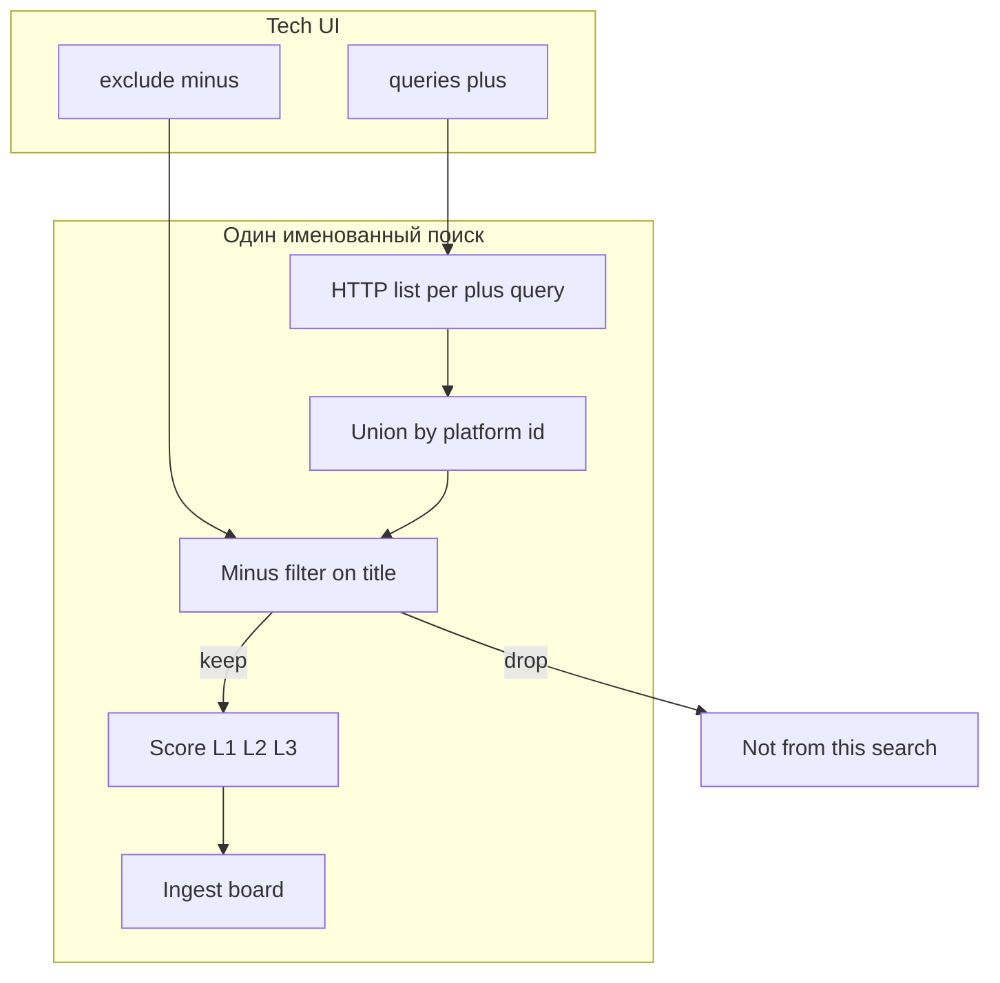

# Система поиска v2 — плюс и минус по пакетам

**status:** accepted (owner 2026-08-28)  
**last-review-date:** 2026-08-28  
**owner lock:** 2026-08-28 (A/B/C/D ниже)  
**плюс-фразы:** [`search-keywords.md`](./search-keywords.md)  
**сущность поиска:** [`named-searches.md`](./named-searches.md)  
**тиры после фильтра:** [`../delivery/fit-tiers.md`](../delivery/fit-tiers.md)  
**задача:** [036](../delivery/tasks/036-search-plus-minus.md) · **код:** не в этом файле (follow-up)

Это **канон новой схемы поиска**. Не накрутка regex «всегда L3». Слои: площадка → наш минус на списке → скоринг → доска.

---

## Owner lock (2026-08-28)

| # | Решение |
| --- | --- |
| A | Минус режет **на сборе списка** (до скоринга и БД) |
| B | Плюс и минус правятся в **Tech UI** (drawer «Править поиск») |
| C | База минусов: жилой / жилых / ЖК; кровля / крыша; ЗАГС / школа / детсад / поликлиника; фасад / благоустройство / дороги |
| C′ | Фраза **«строительный контроль» без НК — не минус** (одной этой фразой лот не выкидываем) |
| D | Плюс-фразы пакетов A–E **оставляем** (полные слова + единственная аббревиатура ВИК) |
| D′ | У **каждого** именованного поиска (пакета) **свой** `exclude[]` |
| D″ | Детсад / школа + **радиограф / НК / УЗК / ВИК как работа** = наша тема → соц- и кровля-минусы **не** вешать на пакеты A/B (услуги и методы) |
| E | **037:** на **всех** пакетах list-minus: `поставка`, `закупка`, `прибор` (union с D-соц-минусами на D) |

---

## Зачем v2

После широких сидов A–E доска забивалась стройнадзором (кровля ЗАГСа и т.п.). Жёсткое правило «строительный контроль → всегда Смотреть» ([035](../delivery/tasks/035-no-build-control-hot.md)) — **ошибочный костыль**: режет грубо и путает поиск со скорингом.

Нужна модель, которую оператор понимает и правит:

1. **Плюс** — что просим у площадки.  
2. **Минус** — что выкидываем из **выдачи этого поиска** по заголовку.  
3. **Скоринг** — уже по очищенному пулу: услуга vs поставка → L1/L2/L3.

---

## Pipeline (один именованный поиск)

```text
Tech: queries[] (плюс) + exclude[] (минус)
  → HTTP list по каждой плюс-фразе
  → union по native id площадки
  → минус-фильтр по title (этот поиск)
        keep → скоринг L1/L2/L3/noise/pool → ingest L1–L3
        drop → не в БД из этого поиска
```



### Очередь нескольких поисков (union)

Лот, отсеянный в пакете **D** из‑за «кровля», **может** остаться, если его нашёл пакет **B** («радиографический контроль»), у которого этого минуса нет. Это **намеренно** (детсад + радиограф).

ИИ — по-прежнему **отдельный** шаг после прогона, не обязательный фильтр списка в v2.

---

## Контракт сущности «поиск»

| Поле | Правило |
| --- | --- |
| `queries` | плюс-фразы; минимум 1; порядок слож → прост |
| **`exclude`** | **новый** массив строк; может быть `[]`; порядок не важен |
| `limit_n` | `0` = без потолка |
| `in_queue` / `sort_order` / `platform_id` / `name` | без смены смысла |

**Правило минуса v1 (простое):**  
заголовок (без учёта регистра) **содержит** минус-фразу как подстроку → строка **не** идёт дальше **по этому поиску**.

Защита от ложного минуса («детсад + радиограф») — **не** умный regex «если рядом НК», а **разные `exclude` на разных пакетах**.

---

## Канон пакетов РосТендер A–E

Плюс — после [034](../delivery/tasks/034-full-keywords-vik-only.md). В пакет D **возвращаем** плюс `строительный контроль` (это не минус).

### A — услуги НК

| | |
| --- | --- |
| **Plus** | `неразрушающий контроль`, `дефектоскопия` |
| **Minus** | `поставка`, `закупка`, `прибор` |
| **Почему** | НК на объекте «детсад» / «кровля цеха» может быть нашим; соц-минусы здесь запрещены |

### B — методы

| | |
| --- | --- |
| **Plus** | `ультразвуковой контроль`, `визуально-измерительный контроль`, `капиллярный контроль`, `радиографический контроль`, `гаммаграфический контроль`, `толщинометрия ультразвуковая` |
| **Minus** | `поставка`, `закупка`, `прибор` |
| **Почему** | эталон owner: радиограф в детсаду = тема |

### C — аббревиатуры

| | |
| --- | --- |
| **Plus** | `ВИК` |
| **Minus** | `поставка`, `закупка`, `прибор` |
| **Почему** | не копировать соц/кровлю: ВИК на объекте со «школой» в адресе может быть валиден |

### D — контроли (главный источник мусора стройнадзора)

| | |
| --- | --- |
| **Plus** | `принимающий контроль`, `приёмочный контроль`, `входной контроль`, **`строительный контроль`** |
| **Minus** | `жилой`, `жилых`, `ЖК`, `кровля`, `крыша`, `ЗАГС`, `школа`, `детсад`, `поликлиника`, `фасад`, `благоустройство`, `дороги`, **`поставка`, `закупка`, `прибор`** |
| **Почему** | минусы режут стройконтроль кровли ЗАГСа **на списке**; радиограф из B не страдает |

### E — страховка

| | |
| --- | --- |
| **Plus** | `контроль сварных соединений`, `сварных соединений` |
| **Minus** | `поставка`, `закупка`, `прибор` |
| **Почему** | сварка в жилом / на кровле всё ещё может быть НК; минусы E — только после смока на проде |

### Сводная таблица

| Пакет | Plus (кратко) | Minus |
| --- | --- | --- |
| A услуги | неразрушающий контроль · дефектоскопия | — |
| B методы | УЗК/ВИК/ПВК/радиограф/гамма/толщинометрия (полные фразы) | — |
| C аббр. | ВИК | — |
| D контроли | принимающий · приёмочный · входной · **строительный** | жилой… · кровля… · ЗАГС/школа/детсад/поликлиника · фасад/благоустройство/дороги |
| E страховка | контроль сварных соединений · сварных соединений | — |

---

## Эталоны (продукт)

### Анти-пример (должен отсечься на пакете D)

Заголовок вроде: «Оказание услуг **строительного контроля** … **кровли** … **ЗАГС** …»  
→ плюс D срабатывает, минус D (`кровля` / `ЗАГС`) → **drop** из D.  
→ В B/A такого плюса нет → на доску **не** попадает (если только D его нашёл).

### Позитивный пример (должен выжить через B)

«Проведение **радиографического контроля** сварных соединений … **детсад** …»  
→ пакет B: плюс есть, минус пуст → **keep** → скоринг → кандидат L1/L2.  
→ Пакет D этот лот мог бы отсечь из‑за «детсад», но B сохраняет его в union очереди.

---

## Tech UI (IA)

В drawer «Править поиск» ([026](../delivery/tasks/026-search-settings-drawer.md)):

- Блок **Плюс** — `queries[]` (как сейчас).  
- Блок **Минус** — `exclude[]`; пустой = «не режем».  
- Подсказка (RU): «Минус отсекает строки списка **этого** поиска до доски. На другие поиски не действует.»

Сиды A–E при будущей миграции заполняют стартовые `exclude` по таблице выше.

---

## Tender.Pro

Тот же принцип: у каждого TP-пакета свой `exclude`. Сиды TP в этом docs-срезе **не** переписываем детально; при коде — симметрия с RT.

---

## Долг кода (не делать в docs-PR)

| Что | Статус |
| --- | --- |
| Hard `is_construction_watch` / «строительный контроль → всегда L3» ([035](../delivery/tasks/035-no-build-control-hot.md)) | **deprecated** — откатить при реализации 036 code |
| Убрать query «строительный контроль» из сидов D | откатить: вернуть в plus D |
| Колонка/поле `exclude`, фильтр в list scrape, UI | follow-up код после owner OK на эту схему |
| Wipe / прогон | отдельный ops после кода |

Скоринг «поставка приборов → L3» ([fit-tiers](../delivery/fit-tiers.md)) **остаётся** — это слой после минус-фильтра, не замена минусам.

---

## Out of scope (v2 docs)

- Новые regex «всегда L3» под стройконтроль.  
- Один глобальный минус на все пакеты.  
- ИИ как обязательный фильтр списка.  
- Код, миграции, VPS, wipe.

---

## Acceptance (docs)

- [x] Схема плюс/минус и pipeline записаны  
- [x] Таблицы A–E plus/minus зафиксированы  
- [x] Эталоны ЗАГС/кровля vs детсад/радиограф  
- [x] Долг 035 помечен deprecated  
- [ ] Owner подтвердил таблицы без правок кода  

## Next

После owner OK → код 036 (миграция `exclude`, фильтр списка, Tech UI, откат hard L3 035).
