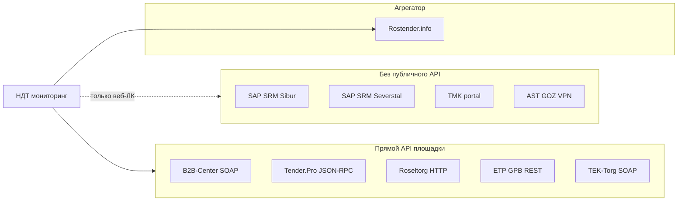
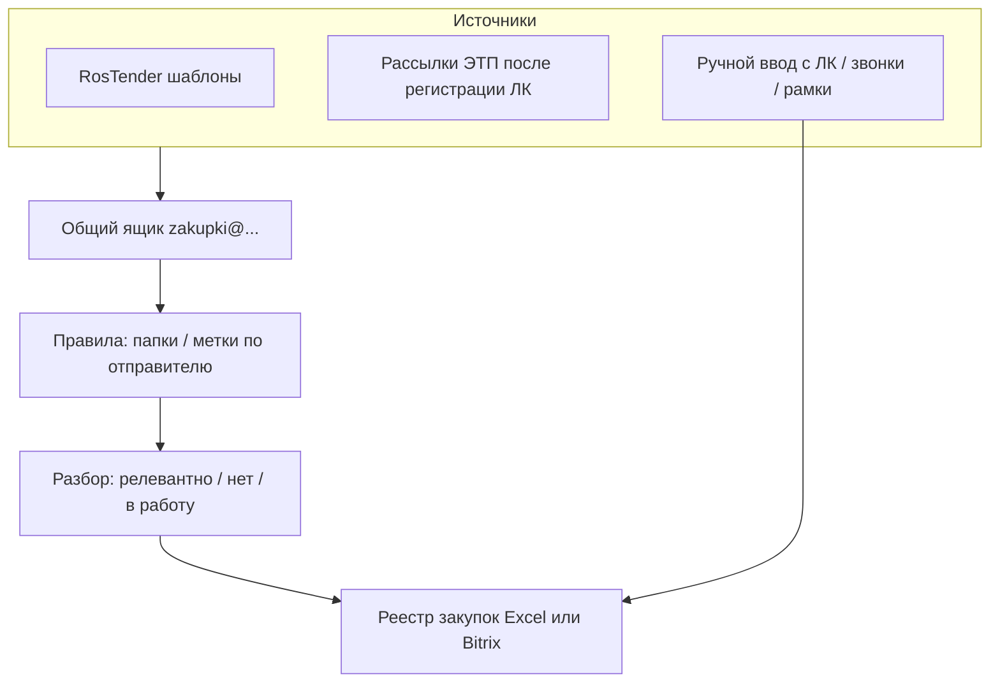

# Ресёрч API тендерных площадок НДТ

**status:** draft  
**owner:** владелец репозитория  
**date:** 2026-07-02  
**Источник списка площадок:** рабочий перечень отдела продаж / тендерного контура НДТ (14 позиций).

**Реестр UI / иконок (канон slug + ассеты):** [`discovery/platforms.md`](./discovery/platforms.md) — не дублировать таблицу хостов здесь; API-выводы остаются в этом файле.

---

## Цель и методология

**Задача:** выяснить по каждой площадке из списка, есть ли API, какой функционал и какие данные он отдаёт — в контексте профиля НДТ (лаборатории неразрушающего контроля: РК/ЦР, ВИК, ПВК; заказчики — нефтегаз, энергетика, строительство, ВПК).

**Метод:**

- Открытые источники: официальные сайты ЭТП, публичная документация, новости операторов, кейсы интеграторов.
- Без доступа в личные кабинеты площадок и без тестовых вызовов API.

**Ограничения ресёрча:**

- Часть документации доступна только авторизованным пользователям или по запросу в поддержку.
- Упоминания API на сторонних каталогах (TenderGuru, Soware) могут относиться к интеграции **для представителей ЭТП**, а не к открытому API для любого поставщика.
- Статус «API есть» не означает пригодность для **мониторинга чужих закупок** — многие интерфейсы ориентированы на заказчиков и ERP.

---

## Ключевой вывод

Большинство корпоративных ЭТП **не предоставляют открытый публичный API для поставщика-наблюдателя**. Там, где API существует:

- документация часто в ЛК или выдаётся по запросу;
- функционал заточен под **заказчиков** и **ERP-интеграцию** (1С, SAP), а не под агрегированный поиск для поставщика;
- для регулярного обхода многих площадок практичнее **агрегатор** (РосТендер) или **готовые CRM-коннекторы**, чем прямой API каждой ЭТП.

---

## Сводная таблица

| № | Площадка | Тип | API | Протокол / доступ | Документация | Мониторинг для поставщика |
| --- | --- | --- | --- | --- | --- | --- |
| 1 | [b2b-center.ru](https://www.b2b-center.ru) | Федеральная ЭТП | **Да** | SOAP, ЛК + тариф | В ЛК (обновление 29.07.2025); WSDL публично | Слабо: API для участия и ERP, не для обзора рынка |
| 2 | [rostender.info](https://rostender.info) | Агрегатор | **Да** (подписка) | Закрытый API; Bitrix24 / amoCRM | По договору; парсинг запрещён | **Высокая** — покрывает 8000+ источников |
| 3 | [onlinecontract.ru](https://onlinecontract.ru) | ЭТП | Частично (SID-ajax JSON) | ЛК + `ajaxnotm.php` | Зонд 2026-08-13 | Список JSON httpx; публичного open API нет |
| 4 | [rosatom.rts-tender.ru](https://www.rosatom.rts-tender.ru) | Секция РТС-тендер | Через РТС | SOAP РТС (заказчик) | Закрытая | ЛК или агрегатор |
| 5 | [srm.sibur.ru](https://srm.sibur.ru) | SAP SRM | **Нет** (Gateway выключен) | NWBC + POWL; Netscape cookies | Зонд 2026-08-13 | ЛК / Playwright NEXT+; OData нет |
| 6 | [tender.pro](https://www.tender.pro) | Федеральная ЭТП | **Да** (JSON-RPC + UI HTML) | PGWS JSON-RPC; UI `good_name` | Зонд 2026-08-13; api/docs | **Средняя** — поиск НК по товару = UI; лента RPC без `_key` не идёт |
| 7 | [kim.tektorg.ru](https://kim.tektorg.ru) | КИМ ТЭК-Торг | Нет отдельного | Веб (родитель tektorg.ru) | КИМ — без API | Веб; основные торги на tektorg.ru |
| 8 | [223.astgoz.ru](https://223.astgoz.ru) | АСТ ГОЗ (закрытая) | **Нет** | ViPNet VPN | Регламент на astgoz.ru | Невозможен без VPN-АРМ |
| 9 | [com.roseltorg.ru](https://com.roseltorg.ru) | Росэлторг (коммерч.) | **Да** | HTTP/HTTPS JSON/XML | Закрытая (поддержка / ЛК) | ЛК или агрегатор |
| 10 | [lk.roseltorg.ru](https://lk.roseltorg.ru) | Росэлторг.ID (вход) | — | OAuth, единый вход | — | Точка входа, не отдельная ЭТП |
| 11 | [oilb2bcs.ru](https://oilb2bcs.ru) | ЭТП НЗНП | Не подтверждён | Веб-ЛК | Нет публичной | Только веб |
| 12 | [etp.gpb.ru](https://etp.gpb.ru) | ЭТП ГПБ | **Да** | REST | [new.etpgpb.ru/portal/api](https://new.etpgpb.ru/portal/api/) | Низкая: API портала, не поиск тендеров |
| 13 | [zakupki.tmk-group.com](https://zakupki.tmk-group.com) | ЭТП ТМК | **Нет** (внешн.) | Веб-ЛК | — | Только веб / агрегатор |
| 14 | [procurement.severstal.com](https://procurement.severstal.com) | SAP SRM Северсталь | **Нет** | Веб-ЛК | Регламент SRM | Только веб / агрегатор |

---

## Детальные карточки площадок

### 1. B2B-Center — b2b-center.ru

| Параметр | Значение |
| --- | --- |
| **Оператор** | B2B-Center — крупная федеральная ЭТП (223-ФЗ, коммерческие закупки, КИМ) |
| **API** | **Да** — SOAP веб-сервис |
| **Endpoint** | `https://www.b2b-center.ru/market/remote.html` (WSDL: `?wsdl`); передача файлов — MTOM через `remote_alternative.html` |
| **Документация** | В **личном кабинете**; обновление описания от 29.07.2025 ([новость](https://www.b2b-center.ru/news/?id=520)). Публично доступен WSDL с перечнем методов |
| **Доступ** | Учётная запись на площадке; часть методов привязана к тарифу |
| **Основной функционал API** | Полный цикл торгов для заказчика и участника: создание/изменение процедур, позиции, заявки, протоколы, переторжка, разъяснения, файлы, участники, совместные закупки |
| **Отдаваемые данные** | XML/SOAP: атрибуты аукциона, позиции, участники, оферты, протоколы, файлы (MTOM) |
| **Примеры методов** | `findParticipantAuctions`, `getData`, `getParticipants`, `getPositions`, `create`, `createExplanation`, `answerExplanation`, `cancel`, `confirmResultsProtocol` |
| **Релевантность для НДТ** | Высокая по охвату заказчиков (нефтегаз, энергетика, промышленность). API ориентирован на **участие в торгах** и ERP заказчиков; для **пассивного мониторинга** удобнее веб-поиск или агрегатор |

---

### 2. РосТендер — rostender.info

| Параметр | Значение |
| --- | --- |
| **Тип** | **Не ЭТП**, а **агрегатор** закупок с 8000+ источников (гос, коммерческие, корпоративные) |
| **API** | **Да** — по подписке; публичной open-документации в открытом доступе **нет** |
| **Ограничения** | На [rostender.info/export](https://rostender.info/export): **запрещено** автоматизированное извлечение данных без официального разрешения ООО «Тендеры и закупки» |
| **Официальные интеграции** | **Bitrix24** ([инструкция](https://rostender.info/articles/integratsiya-rostender-s-bitriks24)), **amoCRM** ([инструкция](https://rostender.info/articles/integraciya-rostender-s)) — приложения в маркетплейсе, ключ из ЛК РосТендер |
| **Данные при выгрузке** | Предмет закупки, заказчик (ИНН, название), регион, ОКПД2/КТРУ, сроки, номер, ссылка на источник; в Bitrix — архив документов по тендеру |
| **Поиск на сайте** | По ИНН/названию заказчика, месту поставки, предмету, ОКПД2/КТРУ, номеру тендера (РосТендер или ЕИС) |
| **Релевантность для НДТ** | **Наиболее практичный путь** для регулярного мониторинга многих площадок из списка одним инструментом. У НДТ уже есть коробочный Bitrix24 на ООО СВАРКА — готовый канал интеграции |

---

### 3. ONLINECONTRACT — onlinecontract.ru

| Параметр | Значение |
| --- | --- |
| **Оператор** | ООО «МХ 1», ЭТП ONLINECONTRACT (Татарстан, топ корпоративных ЭТП РФ) |
| **API** | Открытой публичной документации **нет**. Живой зонд 2026-08-13: список = JSON `GET /otp/ajaxnotm.php?sid={getProcedureListSID}` (SID + Bearer из `APP_INITIAL_STATE`), не OData |
| **UI поиска** | Angular OTP `/otp/Zakupki` («Корпоративные закупки»). Первый HTML без грида |
| **Доступ к API оператора** | Через поддержку: info@onlc.ru; кейс БФТ.Закупки — ERP заказчика, не мониторинг поставщика |
| **Функционал (по кейсам)** | Публикация процедур, обмен электронными документами, запросы разъяснений, переторжка |
| **Зонд (канон)** | [`discovery/onlinecontract-probe.md`](./discovery/onlinecontract-probe.md) — httpx достал `procedureList` (пример id `583187`); адаптер **NEXT+** |
| **Релевантность для НДТ** | Средняя–высокая. Автоматизация списка — отдельный httpx-адаптер (cookies + SID), не копировать P1 rostender вслепую |

---

### 4. РТС-тендер, секция «Росатом» — rosatom.rts-tender.ru

| Параметр | Значение |
| --- | --- |
| **Тип** | Специализированная секция **РТС-тендер** для закупок госкорпорации «Росатом» и организаций атомной отрасли |
| **Связь с B2B** | Секция работает в экосистеме РТС-тендер / B2B-Center; отдельного публичного API секции **нет** |
| **API родительской площадки** | РТС-тендер: SOAP `https://223.rts-tender.ru/customer/api/RtsWebService.svc` — в основном для **заказчиков** (223-ФЗ) |
| **Доступ поставщику** | Личный кабинет на rosatom.rts-tender.ru; ЭДО через оператора «ФИНТЕНДЕР-КРИПТО» |
| **Данные** | Извещения, документация закупки, статусы процедур, подача предложений |
| **Релевантность для НДТ** | **Высокая** (Росатом, ВПК, энергетика). Мониторинг — ЛК, агрегатор или ручной обход |

---

### 5. СИБУР SRM — srm.sibur.ru

| Параметр | Значение |
| --- | --- |
| **Платформа** | **SAP SRM** — корпоративная система взаимодействия с поставщиками ПАО «СИБУР Холдинг» |
| **API** | **Нет** публичного API. Живой зонд 2026-08-13: SAP Gateway **деактивирован** (`/IWFND/CM_COS/003`) |
| **UI поиска** | NWBC + Web Dynpro POWL `APPLID=ZSAPSRM_B_RFXANDAUCTIONS` (`WDCONFIGURATIONID=/SAPSRM/WDA_POWL`). Первый GET — заглушка; грид после JS |
| **Доступ** | Саморегистрация, квалификация, подача предложений через веб-интерфейс; worker — Netscape `cookies.sibur.txt` |
| **Доп. площадка** | Логистика — [7rights](https://www.sibur.ru/ru/procurement/procedure/) (отдельная ЭТП) |
| **Поддержка** | srmsupport@sibur.ru, +7 (495) 777-55-00 (доб. 4058) |
| **Инструкции** | [sibur.ru/ru/procurement](https://sibur.ru/ru/procurement/) — PDF по регистрации, квалификации, подаче предложений |
| **Зонд (канон)** | [`discovery/sibur-srm-probe.md`](./discovery/sibur-srm-probe.md) — факты httpx/Playwright; адаптер **NEXT+**, не копировать P1 rostender |
| **Релевантность для НДТ** | **Высокая** (нефтегаз, химия). Автоматизация = отдельный адаптер (Playwright / WDA / «Экспорт») или агрегатор, не OData |

---

### 6. Tender.Pro — tender.pro

| Параметр | Значение |
| --- | --- |
| **Оператор** | ООО «ТендерПро» — федеральная ЭТП |
| **API** | **Да** — JSON-RPC 2.0 (`POST /api`, сервер PGWS v1.11). Живой зонд не видел SOAP-конверт; HTML-список — отдельный канал |
| **Документация** | [tender.pro/api/docs](https://www.tender.pro/api/docs), [api/docs/smd](https://www.tender.pro/api/docs/smd), [выгрузка ленты процедур](https://help.tender.pro/vigruzka_lenti_procedur.html), [интеграция API](https://help.tender.pro/integraciya_api.html) |
| **Ключевые методы** | `info.tenderlist_by_set` — лента (нужны `_key` + `set_id`); `app.login`; `tender.get_categories`, `tender.get_categories_log`; `tender.get_status` (публично с `{id}`); `company.info_public` |
| **Параметры `tenderlist_by_set`** | `set_type_id`: 1 — процедуры компании, 2 — все процедуры, 3 — холдинг; `set_id`; `max_rows`; `open_only`. Без `_key` — `Y0001`. `good_name` метод **не** принимает |
| **Поиск НК (зонд)** | UI `GET /api/tenders/list?good_name=` (ВИК/ПВК/УЗК/РК) + `tender_state=1` + `country=1`. Не название тендера |
| **Отдаваемые данные** | UI: HTML-таблица; RPC: JSON id/даты/статус при наличии ключа; карточка `/api/tender/{id}/view_public` |
| **Доступ** | Регистрация на площадке; полная интеграция RPC — `_key` / техподдержка Tender.Pro |
| **Альтернатива без API** | HTML-список (зонд) или [конструктор ленты](https://help.tender.pro/vigruzka_lenti_procedur.html) |
| **Зонд (канон)** | [`discovery/tender-pro-probe.md`](./discovery/tender-pro-probe.md) — httpx HTML-грид; адаптер [024](./delivery/tasks/024-tender-pro-adapter.md); поиски [`discovery/named-searches.md`](./discovery/named-searches.md) |
| **Релевантность для НДТ** | **Средняя–высокая**. Мониторинг услуг НК = UI по товару; RPC-лента без ключа мониторинг не закрывает |

---

### 7. КИМ ТЭК-Торг — kim.tektorg.ru

| Параметр | Значение |
| --- | --- |
| **Тип** | **Корпоративный интернет-магазин (КИМ)** секции **ТЭК-Торг** / группа «Роснефть» |
| **Назначение** | Мелкие закупки (до ~5 млн ₽ с НДС) стандартизированной номенклатуры |
| **API** | Отдельного публичного API для КИМ **не обнаружено** |
| **Родительская площадка** | [tektorg.ru](https://www.tektorg.ru) — федеральная ЭТП; SOAP API (регламент в разделе документов; endpoint упоминается как `api.tektorg.ru`) |
| **Доступ** | Регистрация на kim.tektorg.ru; заявки рассматриваются индивидуально |
| **Релевантность для НДТ** | Низкая–средняя для услуг НК (чаще товары/мелкие закупки); нефтегазовый контур релевантен косвенно |

---

### 8. АСТ ГОЗ — 223.astgoz.ru

| Параметр | Значение |
| --- | --- |
| **Тип** | Специализированная ЭТП для **закрытых закупок** ГОЗ и оборонного комплекса (44-ФЗ и 223-ФЗ) |
| **API** | **Нет** публичного API |
| **Доступ** | Защищённая сеть через **ViPNet Client**; браузер **Mozilla Firefox**; секции: `44.astgoz.ru` (44-ФЗ), `vpn.astgoz.ru` / `223.astgoz.ru` (223-ФЗ) |
| **Требования** | ЭЦП, аккредитация, оплачиваемая лицензия ViPNet, отдельное рабочее место |
| **Релевантность для НДТ** | **Высокая** по отрасли (ВПК, оборонка). Автоматизация мониторинга извне **невозможна** без VPN-АРМ; только ручная работа на выделенном ПК |

---

### 9. Росэлторг, коммерческие закупки — com.roseltorg.ru

| Параметр | Значение |
| --- | --- |
| **Оператор** | Единая электронная торговая площадка «Росэлторг» (АО «ЕЭТП») |
| **API** | **Да** — HTTP/HTTPS, JSON и XML (по кейсам интеграции с 1С:ERP) |
| **Документация** | **Закрытая** — через [Центр поддержки](https://cpp.roseltorg.ru/) и личный кабинет |
| **Функционал API (по кейсам)** | Публикация закупочных процедур, передача ТКП и документов, получение предложений поставщиков, статусы процедур |
| **Крупные заказчики на площадке** | Росатом, Ростех, Лукойл, Роснефть, Ростелеком, Росгидро и др. |
| **Релевантность для НДТ** | **Высокая**. Мониторинг для поставщика — ЛК, агрегатор или ручной поиск |

---

### 10. Росэлторг.ID — lk.roseltorg.ru

| Параметр | Значение |
| --- | --- |
| **Тип** | **Единая точка входа (OAuth)** в экосистему Росэлторг, не отдельная торговая секция |
| **API** | Не применимо как самостоятельная площадка |
| **Назначение** | Авторизация, регистрация, перенос учётной записи между секциями (com, corp, zakupki и др.) |
| **Релевантность для НДТ** | Служебный URL; закупки смотреть в соответствующих секциях (com.roseltorg.ru и др.) |

---

### 11. НЕФТЬ-B2B — oilb2bcs.ru

| Параметр | Значение |
| --- | --- |
| **Оператор** | ЭТП группы **АО «НЗНП»** (Новошахтинский завод нефтепродуктов), Ростовская область |
| **Назначение** | Закупки и реализация для предприятий нефтегазовой отрасли |
| **API** | Упоминается json/xml «для представителей ЭТП» (TenderGuru) — **публичной документации и endpoint не найдено** |
| **Интерфейс** | Веб: заявки на закупку / реализацию, поиск по категориям номенклатуры |
| **Контакты** | +7 (863) 310-97-15, info@oilb2bcs.ru |
| **Релевантность для НДТ** | **Средняя** (нефтегаз). Только веб-ЛК; при необходимости API — запрос оператору |

---

### 12. ЭТП ГПБ — etp.gpb.ru

| Параметр | Значение |
| --- | --- |
| **Оператор** | Электронная торговая площадка Газпромбанка |
| **API** | **Да** — REST, описание на [new.etpgpb.ru/portal/api](https://new.etpgpb.ru/portal/api/) |
| **API заказчика** | Получение ценовых запросов и заказов; создание ценовых запросов; получение ответов поставщиков; создание заказов; смена статусов |
| **API поставщика** | CRUD позиций прайс-листа (добавление, обновление, дублирование, удаление; нормализация номенклатуры) |
| **Отдаваемые данные** | Ценовые запросы, заказы, ответы поставщиков, позиции прайс-листа |
| **Дополнительно** | ЭДО, интеграция с 1С ([edo.etpgpb.ru](https://new.etpgpb.ru/edo/)) |
| **Релевантность для НДТ** | Средняя по отрасли (нефтегаз, финансы). API **не для поиска чужих тендеров**, а для работы в торговом портале; поиск закупок — через веб |

---

### 13. ТМК — zakupki.tmk-group.com

| Параметр | Значение |
| --- | --- |
| **Оператор** | ПАО «ТМК» (Трубная металлургическая компания) |
| **API** | **Нет публичного API** для внешних поставщиков |
| **Внутренняя интеграция** | Web-сервисы для **SAP ERP** ТМК (кейс [АйТи-Баланс](https://intec-balance.ru/project/dorabotka-ploshadki-zakupok-tmk)) — публикация и проведение закупок из ERP |
| **Доступ поставщику** | Регистрация, аккредитация, ЭЦП; веб-интерфейс площадки |
| **Релевантность для НДТ** | **Средняя** (металлургия, строительные объекты). Только веб-ЛК или агрегатор |

---

### 14. Северсталь SRM — procurement.severstal.com

| Параметр | Значение |
| --- | --- |
| **Платформа** | **SAP SRM + SAP SLC** (Supplier Lifecycle Management) ГК «Северсталь» |
| **API** | **Нет публичного API** |
| **URL портала** | `https://procurement.severstal.com/irj/portal` |
| **Данные в системе** | Закупочные процедуры, ТЗ (после регистрации), квалификация, подача предложений, управление данными организации |
| **Регламент** | [Reglament_SRM.pdf](https://suppliers.severstal.com/upload/docs/Reglament_SRM.pdf) |
| **Поддержка** | srm@severstal.com, +7 800 700 82 80 |
| **Важно** | Северсталь **не размещает** актуальные процедуры на сторонних сайтах; официальный источник — только SRM |
| **Релевантность для НДТ** | **Высокая** (металлургия, строительство, промышленность). Автоматизация — агрегатор (если источник индексируется) или обязательный ЛК |

---

## Ключевые слова поиска под профиль НДТ

Блок для будущих шаблонов мониторинга (агрегатор, Bitrix, ручной поиск). Терминология — по [profile.md](../../company/profile.md) и skill `ndt-domain-advisor`.

### Основные (включать)

| Группа | Ключевые слова и фразы |
| --- | --- |
| **Зонтичный термин** | неразрушающий контроль, НК, лаборатория НК, лаборатория неразрушающего контроля |
| **РК / радиография** | радиографический контроль, рентгенографический контроль, гаммаграфический контроль, радиационный контроль, цифровая радиография, ЦР, рентгеновский контроль |
| **ВИК** | визуальный и измерительный контроль, ВИК, визуальный контроль |
| **ПВК** | капиллярный контроль, ПВК, контроль проникающими веществами, люминесцентный контроль |
| **УК (допуск)** | ультразвуковой контроль, УЗК, УК, ультразвуковая дефектоскопия |
| **Смежные формулировки в ТЗ** | дефектоскопия, контроль сварных соединений, контроль сварных швов, контроль металла, контроль качества сварки, аттестация сварщиков *(осторожно: не путать с основным профилем)* |
| **Объекты** | трубопровод, резервуар, котёл, НПЗ, ГРС, ЛЭП, металлоконструкции, сварное соединение |

### Слова-исключения (уменьшать шум)

| Исключать / осторожно | Почему |
| --- | --- |
| толщинометрия (без уточнения) | У НДТ оценка толщины — в рамках ЦР, не отдельный продукт «толщинометрия» |
| обучение НК, курсы НК, аттестация *(как основной предмет)* | Не коммерческий продукт компании |
| продажа дефектоскопов, поставка оборудования НК | НДТ — услуги лаборатории, не торговля приборами |
| разрушающий контроль, механические испытания | Другой вид контроля |

### Заказчики из списка площадок (фильтр по организатору)

Сибур, Росатом, Северсталь, ТМК, Роснефть (ТЭК-Торг), Газпромбанк / дочерние, НЗНП, крупные генподрядчики на B2B-Center и Росэлторг.

---

## Предлагаемый порядок работы: «одна почта → реестр» (обсуждение)

**status:** draft · **не утверждено владельцем**

Сейчас контур тендеров не настроен: нет единой точки входа, нет реестра, нет регулярности. API большинства площадок для пассивного мониторинга недоступен (см. сводную таблицу выше). **Практичный нулевой шаг** — не ждать интеграций, а навести порядок через почту и одну таблицу.

### Почему это разумно как v0

| Плюс | Пояснение |
| --- | --- |
| Низкий порог | Подписки на рассылки ЭТП и агрегатора не требуют разработки |
| Юридически чище парсинга | Официальные уведомления от площадок и РосТендера — не обход защиты сайтов |
| Сразу виден объём | За 2–4 недели станет ясно, сколько писем реально приходит и откуда |
| Мост к Bitrix | Позже те же письма можно заводить в CRM (РосТендер → Bitrix24 уже есть) |
| Не мешает API | Когда появится аккаунт на Tender.Pro / B2B — реестр остаётся единым журналом |

| Минус / ограничение | Пояснение |
| --- | --- |
| Не всё приходит на почту | SAP SRM (Сибур, Северсталь) часто требует захода в ЛК; письма могут не приходить без настройки в системе |
| Дубли | Один тендер может прийти из агрегатора и с ЭТП |
| Ручной разбор | На старте кто-то должен переносить данные в таблицу (5–15 мин в день при умеренном потоке) |
| АСТ ГОЗ | Закрытый контур VPN — в общую почту **не попадёт**; отдельная строка в реестре «источник: ручной обход VPN» |

### Схема потока (v0)

### Шаг 1. Одна «входная» почта

**Идея:** один общий ящик (или общий алиас + папка), куда стекаются все уведомления о закупках. Не личная почта сотрудника.

**Кандидаты (на выбор владельца):**

| Вариант | Плюс | Минус |
| --- | --- | --- |
| `zakupki@svarka.ooo` (M365) | Рядом с Bitrix24 ООО СВАРКА; общий доступ в команде | НДТ-Консалтинг сейчас на `@ndt-consulting.ru` (Я360) — письма разнесены по юрлицам |
| Отдельный ящик на `@ndt-consulting.ru` | Логично для федерального сегмента НДТ-К | Другой почтовый контур (ADR-004 — миграция в процессе) |
| Один ящик + пересылка с обоих доменов | Единая точка без спора «чей тендер» | Нужно настроить forward/CC |

**Рекомендация для обсуждения:** начать с **одного ящика на том домене, где уже есть общая почта и Bitrix** (скорее `@svarka.ooo`), с правилом: в реестре всегда указывать **юрлицо участия** (НДТ-Консалтинг / ООО СВАРКА) — это не то же самое, что домен почты.

**Кто владелец ящика:** один ответственный (тендер/продажи), остальные — читатели или получают дайджест.

### Шаг 2. Подписки и «теги»

**Агрегатор (приоритет):**

1. РосТендер — 1–3 **шаблона поиска** по ключевым словам из раздела выше (отдельные шаблоны для РК, ВИК/ПВК, общий «лаборатория НК»).
2. Рассылка на общий ящик; опционально Telegram дублировать ответственному (быстрее почты).
3. Позже — авто-выгрузка шаблона в Bitrix24 (когда появится подписка и приложение).

**Площадки из списка (после регистрации ЛК):**

В личном кабинете ЭТП обычно есть «подписка на категории / рассылка / избранные заказчики». Настроить уведомления на общий ящик для:

- B2B-Center, Tender.Pro, Росэлторг (com), ТЭК-Торг — высокий приоритет;
- РТС Росатом, ONLINECONTRACT, ЭТП ГПБ, НЕФТЬ-B2B — средний;
- Сибур SRM, Северсталь SRM, ТМК — проверить, **приходят ли** письма; если нет — в реестре источник «ЛК, еженедельный обход».

**«Теги» в почте (правила M365 / Outlook):**

| Метка / папка | Критерий (пример) |
| --- | --- |
| `RT/` | Отправитель содержит rostender |
| `ETP/B2B` | b2b-center.ru |
| `ETP/Roseltorg` | roseltorg.ru |
| `ETP/Other` | остальные домены из списка |
| `!review` | Всё непрочитанное за сегодня — очередь разбора |

Это не замена реестра, а **сортировка входа** перед переносом в таблицу.

### Шаг 3. Реестр — одна таблица с ключевыми полями

**Где хранить v0:** Excel / Google Таблица на общем диске (OneDrive Сварки или NAS — по политике файлов). **v1:** смарт-процесс или лиды в Bitrix24.

**Минимальный набор колонок:**

| Поле | Зачем |
| --- | --- |
| `id` | Порядковый номер или дата-NNN |
| `дата_поступления` | Когда увидели закупку |
| `источник` | Rostender / B2B-Center / SRM Сибур / ручной / … |
| `ссылка` | URL процедуры на ЭТП |
| `заказчик` | Наименование, при возможности ИНН |
| `предмет` | Кратко из извещения |
| `регион` | Место выполнения работ |
| `дедлайн_подачи` | Критично для решения «успеваем / нет» |
| `оценка_суммы` | Если есть в извещении |
| `релевантность` | да / нет / уточнить |
| `юрлицо_участия` | НДТ-Консалтинг / ООО СВАРКА |
| `статус` | см. ниже |
| `ответственный` | Кто ведёт |
| `комментарий` | Почему отказ, риски, нужна аккредитация на площадке |

**Статусы (простая воронка):**

`новое` → `на разборе` → `релевантно` → `готовим участие` → `подали` → `выиграли` / `проиграли` / `отказ` / `пропущен срок`

**Регламент разбора (черновик):**

- 1 раз в день (или 2 раза в неделю минимум) — просмотр папки `!review`.
- Новые строки в реестре — в день поступления письма.
- Если дедлайн &lt; 3 рабочих дней — пометка срочности в комментарии.

### Шаг 4. Дедупликация

Один и тот же тендер часто приходит дважды (РосТендер + ЭТП). Правило: **ключ дубликата** = `ссылка` на процедуру; если ссылки разные, но предмет и заказчик совпадают — сверка вручную. В реестре одна строка, в комментарии — «дубль: письмо от …».

### Что сознательно не делаем на v0

- Парсинг почты скриптами и авто-заполнение таблицы (можно v1, когда стабилизируются поля).
- Прямые API всех 14 площадок.
- Обязательная интеграция с Bitrix до появления регулярного реестра.

### Этапы эволюции

| Этап | Содержание | Ориентир |
| --- | --- | --- |
| **v0** | Общий ящик + подписки + Excel-реестр + ежедневный разбор | 2–4 недели на раскачку |
| **v1** | Правила почты, шаблоны РосТендера, дедупликация; оценка потока (писем/нед, % релевантных) | После первого месяца |
| **v2** | РосТендер → Bitrix24; лиды/сделки вместо Excel | При подписке и готовности продаж |
| **v3** | Точечный API Tender.Pro (RPC-лента) только с `_key` и если UI-списка мало | По данным реестра / зонда |

### Открытые вопросы к владельцу

1. Какой ящик берём за основу — `@svarka.ooo`, `@ndt-consulting.ru` или оба с пересылкой?
2. Кто **единственный ответственный** за разбор входящих (имя/роль)?
3. Есть ли уже аккаунты/регистрации на площадках из списка — или подписки настраиваем с нуля?
4. РосТендер — есть подписка или рассматриваем trial?
5. Реестр v0 — Excel на OneDrive или сразу пробуем список в Bitrix24?

---

## Практические выводы

1. **Прямой API имеет смысл точечно:** Tender.Pro — UI-список по `good_name` (зонд 2026-08-13); JSON-RPC лента только с `_key`. B2B-Center — при аккаунте и задаче участия. Остальные открытые API — в основном для заказчиков и ERP.

2. **Пять площадок из списка — закрытые SRM/порталы без внешнего API:** Сибур, Северсталь, ТМК, АСТ ГОЗ (дополнительно VPN), КИМ ТЭК-Торг. Для них — только веб-ЛК или агрегатор (где источник индексируется).

3. **РосТендер — не конкурент ЭТП, а способ закрыть проблему «нерегулярный ручной обход»:** один инструмент вместо 14 вкладок; официальная интеграция с Bitrix24 совпадает с цифровым контуром ООО СВАРКА.

4. **Парсинг сайтов без разрешения юридически рискован:** у РосТендер явный запрет; у ТЭК-Торг — защита от ботов. Предпочтительны официальные API, подписки и CRM-коннекторы.

5. **АСТ ГОЗ — отдельный контур:** даже при высокой отраслевой релевантности (ВПК) автоматизация невозможна без выделенного VPN-рабочего места и аккредитации.

6. **Порядок навести можно без API:** общий ящик + подписки (РосТендер + рассылки ЭТП) + один реестр с полями и статусами — реалистичный v0, пока тендерный контур «с нуля» (см. раздел «Предлагаемый порядок работы» выше).

---

## Источники

### Официальные

- B2B-Center API: [новость об обновлении документации](https://www.b2b-center.ru/news/?id=520), [WSDL remote.html](https://www.b2b-center.ru/market/remote.html)
- Tender.Pro: [api/docs](https://www.tender.pro/api/docs), [api/docs/smd](https://www.tender.pro/api/docs/smd), [выгрузка ленты](https://help.tender.pro/vigruzka_lenti_procedur.html), [интеграция API](https://help.tender.pro/integraciya_api.html)
- РосТендер: [export / условия](https://rostender.info/export), [интеграция Bitrix24](https://rostender.info/articles/integratsiya-rostender-s-bitriks24)
- Росэлторг: [roseltorg.ru](https://www.roseltorg.ru/), [com.roseltorg.ru](https://com.roseltorg.ru/), [Центр поддержки](https://cpp.roseltorg.ru/)
- РТС-тендер / Росатом: [rosatom.rts-tender.ru](https://www.rosatom.rts-tender.ru/about/)
- ТЭК-Торг: [tektorg.ru](https://www.tektorg.ru/), КИМ: [kim.tektorg.ru](https://kim.tektorg.ru/)
- ЭТП ГПБ API: [new.etpgpb.ru/portal/api](https://new.etpgpb.ru/portal/api/)
- СИБУР: [sibur.ru/ru/procurement](https://www.sibur.ru/ru/procurement/), [srm.sibur.ru](https://srm.sibur.ru/)
- Северсталь SRM: [suppliers.severstal.com/procurement](https://suppliers.severstal.com/procurement/), [регламент SRM](https://suppliers.severstal.com/upload/docs/Reglament_SRM.pdf)
- ONLINECONTRACT: [onlinecontract.ru](https://onlinecontract.ru/)
- НЕФТЬ-B2B: [oilb2bcs.ru](https://oilb2bcs.ru/)
- ТМК: [zakupki.tmk-group.com](https://zakupki.tmk-group.com/)
- АСТ ГОЗ: [astgoz.ru](https://www.astgoz.ru/), [223.astgoz.ru](https://223.astgoz.ru/)

### Кейсы и обзоры интеграций

- БФТ ↔ ONLINECONTRACT: [bft.ru](https://bft.ru/company/media/publikatsii/keys-bft-integratsiya-srm-s-etp/)
- 1С:ERP ↔ Росэлторг: [rdn-service.ru](https://smolensk.rdn-service.ru/articles/1s/keyc-integratsiya-1s-erp-i-roseltorg-dlya-ao-mosinzhproekt-/)
- ТМК ↔ SAP ERP: [intec-balance.ru](https://intec-balance.ru/project/dorabotka-ploshadki-zakupok-tmk)
- B2B-Center SOAP/MTOM (1С): [infostart.ru](https://infostart.ru/1c/articles/1045578/)
- РТС-тендер SOAP: [saby.ru/help/edo/torg/rts_tender](https://saby.ru/help/edo/torg/rts_tender)

### Профиль компании

- [docs/company/profile.md](../../company/profile.md)
